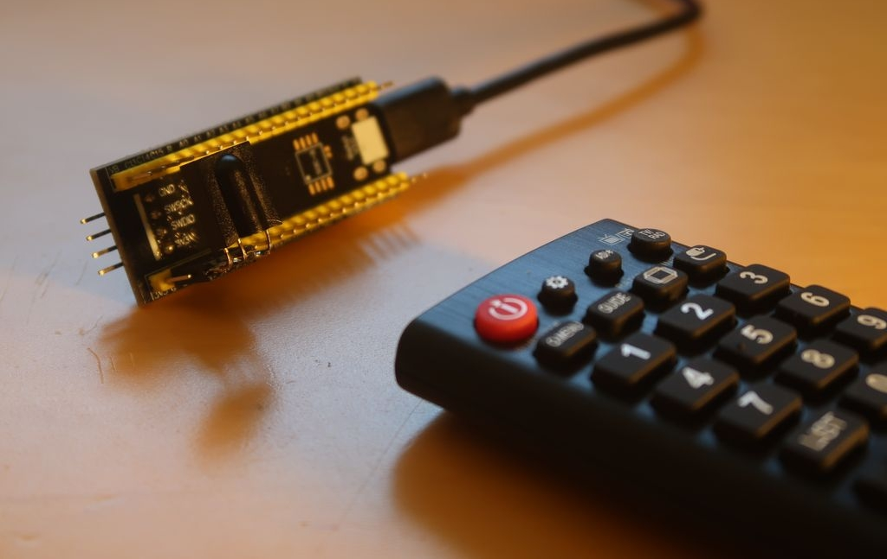
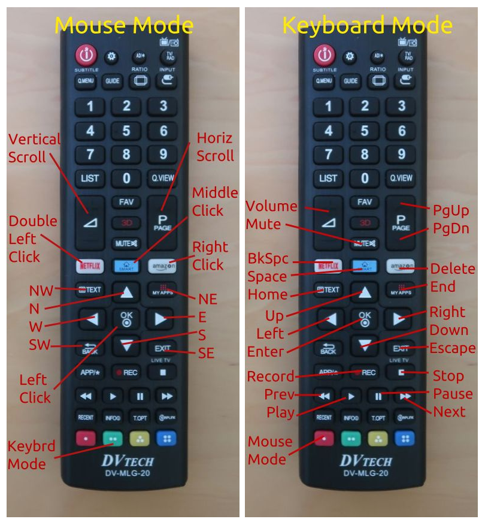
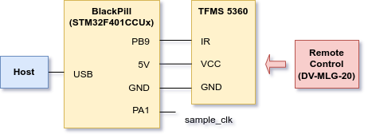
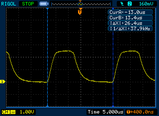
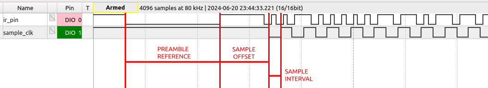
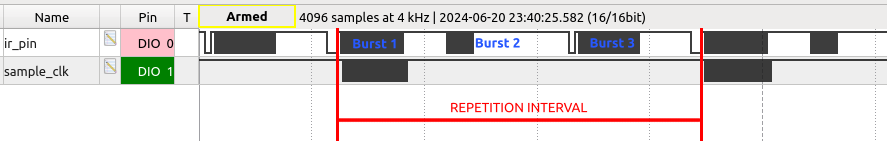

# RTIC MicKey Mouse

Remote control as a Mouse & Keyboard.



## Features

- Mouse Mode and Keyboard Mode.
- Dynamically adjusted speed of the mouse pointer.
- Single and double click of the mouse buttons.
- Enable/disable button.
- Compatible with Windows, Linux, Android.

## Usage



## Hardware Design



- Remote control emits modulated IR signal (CH1, captured using photodiode).

- TFMS5360 receives IR signal and demodulates (CH2, captured at PB9).
  
    

- Demodulated signal is provided at PB9 of STM32.

- STM32 converts codes from the remote control to keyboard/mouse codes and sends over USB to the host.

Notes:

- PA1 is used only for development/calibration. It doesn't play any role in normal operation.

- VCC of STM32 is 3.3V while VCC of TFMS5360 is 5V. Luckily GPIOs of STM32 are 5V-tolerant, so TFMS5360 can be connected directly to STM32.

- TFMS5360 is optimized for signals modulated by 36 kHz. Despite of this, it successfully receives signal from DV-MLG-20 is modulated by 38 kHz.
  
    

## Software Design

Software is implemented in Rust and based on [RTIC](https://rtic.rs/). It implements one HID device with three types of reports:

- MouseReport
- KeyboardReport
- MediaKeyboardReport

Application waits for the fallinig and rising edge of the IR signal. If duration between them equals `PREAMBLE_REFERENCE` ± `PREAMBLE_TOLERANCE`, application waits for `SAMPLE_OFFSET_US` and starts collecting 52 samples with the interval of `SAMPLE_INTERVAL_US`.



This corresponds to the first burst generated after pressing a button on the remote control. Following two bursts are ignored.



Application considers a button as held if delay between repetitions is shorter than `MAX_REPETITION_INTERVAL`. This affects data sent to the host (e.g. speed of the mouse pointer).

Data from the remote control is 52 bits long, where upper 20 bits are expected to be constant `MAGIC_PREFIX`. Data that doesn't meet this requirement is discarded. Remaining 32 bits describe key-codes. After succesfull reception of the key-code, STM32 turns off LED for the duration of `BLINK_DURATION_MS`.

After each report corresponding to the button-press event, device generates a sibling report to simulate button-release event. That occures after `MOUSE_BUTTON_RELEASE_DELAY` or `KEYBOARD_BUTTON_RELEASE_DELAY` respectively.

Device can also simulate double-click of the mouse left button. Delay between clicks is defined as `MOUSE_DOUBLE_CLICK_DELAY`.

User btton "Key" of the device can be used to enable/disable reception. This is signalled by toggling LED. The button is debounced with `DEBOUNCE_DELAY` parameter.

## Development

Prepare environment:

```sh
rustup +nightly target add thumbv7em-none-eabihf
cargo install flip-link
cargo install probe-rs --features cli # this also installs cargo-flash
```

Connect BlackPill board through WCHLink or ST-Link.

```sh
# only build
cargo build -r

# build & run
cargo run -r

# flash
cargo flash --release --chip STM32F401CCUx
```

## Acknowledgments

- Parts of the code have been inspired by [kalkyl/f411-rtic](https://github.com/kalkyl/f411-rtic).

- Hints on using multiple HID reports has been found [here](https://community.infineon.com/t5/Knowledge-Base-Articles/How-to-Implement-Multiple-HID-Class-Functionalities-with-a-Single-HID-interface/ta-p/249588#.).

- USB descriptor has been generated using [USB Descriptor and Request Parser](https://eleccelerator.com/usbdescreqparser/).

- Free PIDs/VIDs have been found [here](https://github.com/obdev/v-usb/blob/master/usbdrv/USB-IDs-for-free.txt).
